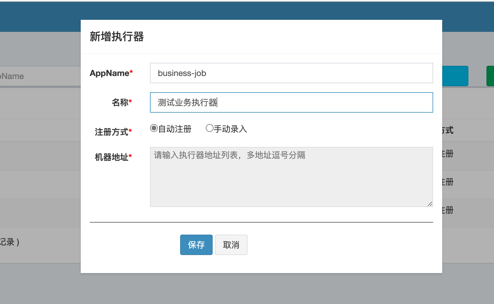
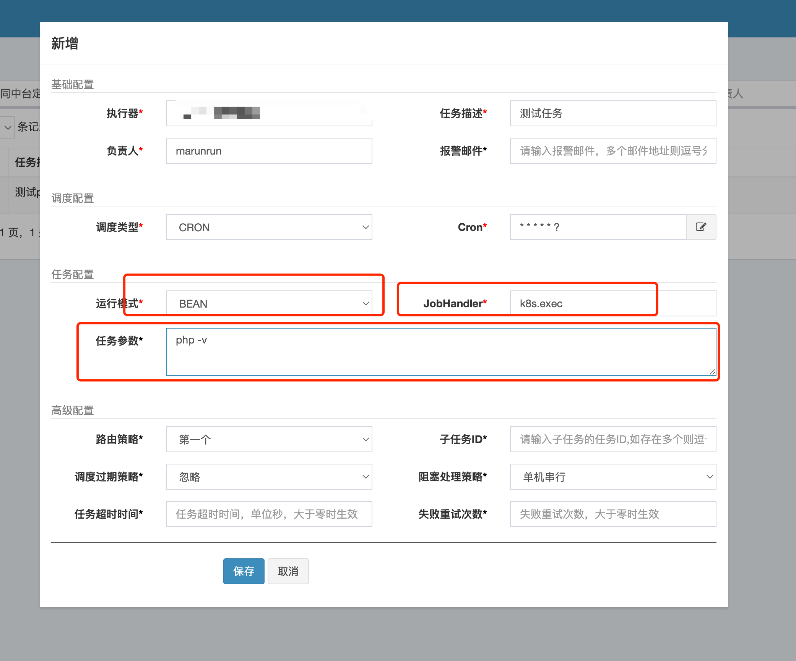
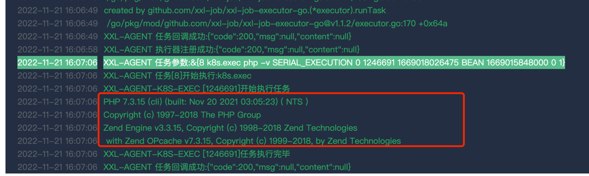

# XXL-AGENT

基于 XXL-JOB 的分布式任务调度执行器 专给K8s使用

> 历史的定时任务通过K8s的CronJob实现，每次需要拉取镜像，启动新的pod 比较浪费资源
> 
> 现在使用sidecar的方式，只需要在原有的deploy中增加这个agent，然后通过pod/exec的方式在业务容器中执行对应任务


## 配置环境变量
```env
##### xxl job 配置
# xxljob admin address
XXL_JOB_ADDR=http://xxl-job.sk8s.cn/xxl-job-admin
# xxljob  token
XXL_JOB_ACCESS_TOKEN=

# xxljob  executor name 执行器名称 每个项目的执行器名字都不一样 
XXL_JOB_NAME=contract-job


##### k8s 配置
# 是否在k8s内部 默认是 如果是本机测试请修改环境变量为false 请确保~/.kube/conf 配置正常
IN_CLUSTER=true

# 命名空间
NAMESPACE=contract
# pod名称
POD_NAME=xxl-job-test-bc7d6764f-59lzp
# 具体执行命令的容器
CONTAINER_NAME=contract-api
```

## example

部署参考 [deploy.yaml](./example/deploy.yaml)

上面有两个容器`contract-api`,`xxl-job-agent`

其中`contract-api`是我们的业务容器, `xxl-job-agent`是执行器容器

业务容器不需要进行任何修改，在执行器容器中需要配置环境变量
```yaml
- name: XXL_JOB_ADDR
  value: 'http://xxl-job.company.svc.cluster.local:8080/xxl-job-admin'
- name: XXL_JOB_NAME
  value: business-job
- name: CONTAINER_NAME
  value: business-api
- name: NAMESPACE
  valueFrom:
    fieldRef:
      apiVersion: v1
      fieldPath: metadata.namespace
- name: POD_NAME
  valueFrom:
    fieldRef:
      apiVersion: v1
      fieldPath: metadata.name
```

在k8s内部，我们可以使用内网的dns地址来配置xxl_job_addr

然后配置执行器名称，以及业务容器的名称

namespace跟pod_name 

然后我们需要给`namespace`的`servicesaccount`添加`clusterrolebinding`权限

参考 [rbac.yaml](./example/rbac.yaml)
```yaml
apiVersion: rbac.authorization.k8s.io/v1
kind: ClusterRoleBinding
metadata:
  name: xxl-job-agent-rolebinding
roleRef:
  apiGroup: rbac.authorization.k8s.io
  kind: ClusterRole
  name: xxl-job-agent-exec
subjects:
  - kind: ServiceAccount
    name: default
    namespace: default
```
如果是新的命名空间，需要添加新的`subject`,例如：新的命名空间`my-test`
添加如下 ,注意是添加 ，不要覆盖原有的
```yaml
  - kind: ServiceAccount
    name: default
    namespace: my-test
```


#### 新增执行器



这里的AppName 就是上面环境变量的`XXL_JOB_NAME`

如果没啥问题的话，执行器那里就能看到机器地址了


#### 增加任务



这里运行模式选择`BEAN`

`JobHandler` 就是上面`main.go`注册的	`k8s.exec`

任务参数：需要运行的命令，例如上面的`php -v `  实际上应该是你需要在业务容器内运行的命令


手动执行一次，能看到输出就说明没啥问题了




这样只用给需要定时任务的`deploy`加上`agent` ，然后再去xxl-job里加上执行器，任务就可以了。这样不会再有多余的pod，每次定时任务都是在业务容器内去执行了。


> [xxl-job/xxl-job-executor-go: xxl-job 执行器（golang 客户端） (github.com)](https://github.com/xxl-job/xxl-job-executor-go)
>
> [分布式任务调度平台XXL-JOB (xuxueli.com)](https://www.xuxueli.com/xxl-job/)
>
> 


